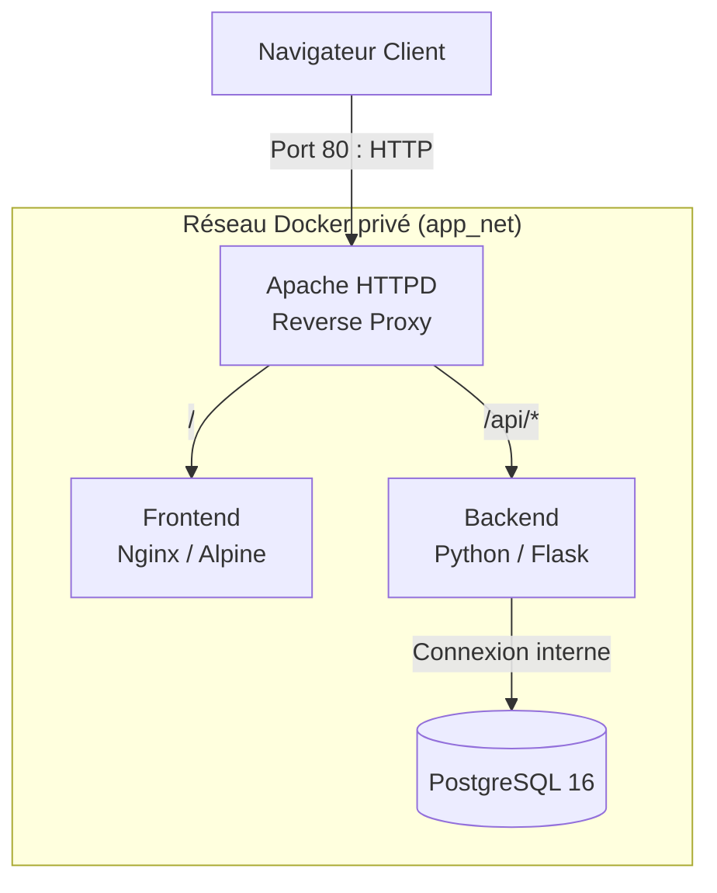

#  Projet de Déploiement d'Architecture Conteneurisée (DevOps)

Ce projet a été réalisé dans le cadre d'un exercice technique de **Stage DevOps / Administration Système & Réseau**.

L'objectif est de déployer une application web conteneurisée composée d'un **Frontend**, d'un **Backend**, d'une **base de données PostgreSQL** et d'un **Reverse Proxy Apache**, tout en appliquant les bonnes pratiques de sécurité, d'isolation réseau et de documentation.

---

#  Architecture Technique

L'application est composée de quatre services Docker orchestrés et isolés.



Les services sont les suivants :

* **Reverse Proxy (Apache HTTPD)**
  Point d'entrée unique de l'application. Il expose uniquement le port **80** et redirige les requêtes vers le Frontend ou le Backend.

* **Frontend (Nginx / Alpine)**
  Héberge une page HTML simple permettant d'interagir avec l'API.

* **Backend (Python / Flask)**
  Expose les routes suivantes :

  * `/health`
  * `/version`
  * `/db-check`

* **Base de données (PostgreSQL)**
  Stocke les données de l'application et crée automatiquement la table `app_status` au démarrage.

---

#  Choix Techniques et Sécurité

## Isolation réseau

Tous les conteneurs sont connectés à un réseau Docker privé.

```yaml
networks:
  app_net:
    driver: bridge
```

Seul Apache est exposé vers l'extérieur.

Le Backend et PostgreSQL restent accessibles uniquement depuis le réseau Docker.

---

## Gestion des variables d'environnement

Les informations sensibles ne sont jamais écrites directement dans le code.

Les paramètres sont stockés dans :

* `.env`
* `.env.example`

Exemple :

```env
POSTGRES_DB=appdb
POSTGRES_USER=appuser
POSTGRES_PASSWORD=superpassword
POSTGRES_HOST=postgres
```

---

## Reverse Proxy Apache

Apache reçoit toutes les requêtes sur :

```text
http://localhost
```

Puis redirige automatiquement :

* `/` → Frontend
* `/api/*` → Backend

---

## Optimisations (Bonus)

Le projet intègre plusieurs bonnes pratiques et éléments complémentaires :

* Réseau Docker dédié (`app_net`) pour isoler les services.
* Utilisation de variables d'environnement pour la configuration de l'application et de PostgreSQL.
* Fichier `.env.example` permettant de recréer facilement l'environnement.
* Documentation complète (`README.md` et `docs/troubleshooting.md`) pour faciliter le déploiement et le diagnostic.
* Script de supervision (`scripts/check.sh`) permettant de vérifier automatiquement l'état des services et des principaux endpoints.
* Reverse Proxy Apache configuré avec `ProxyPass` et `ProxyPassReverse` pour séparer le Frontend et le Backend.
* Dockerfile multi-stage :** Séparation de l'étape de build et d'exécution pour réduire la taille de l'image finale.
* Sécurité Non-Root :** Le conteneur Backend s'exécute avec un utilisateur aux privilèges restreints (`flaskuser`) au lieu de `root`.

---

#  Guide de démarrage

## Prérequis

Avant de commencer, installer :

* Docker Desktop
* Git
* Visual Studio Code

---

## 1. Cloner le projet

```bash
git clone https://github.com/GuezouriSofiane/DevOPS.git
cd DevOPS
```

---

## 2. Créer le fichier d'environnement

Copiez le fichier d'exemple :

```bash
cp .env.example .env
```

Puis adaptez les variables si nécessaire.

---

## 3. Construire et démarrer les conteneurs

```bash
docker compose up -d --build
```

---

## 4. Vérifier les conteneurs

```bash
docker compose ps
```

---

## 5. Vérifier le fonctionnement

```bash
./scripts/check.sh
```

---

#  Commandes utiles

## Afficher les conteneurs

```bash
docker compose ps
```

## Afficher les logs

```bash
docker compose logs -f
```

## Arrêter l'environnement

```bash
docker compose down
```

## Reconstruire complètement

```bash
docker compose down
docker compose up -d --build
```

---

#  Endpoints disponibles

Une fois les conteneurs démarrés :

| Service        | URL                           |
| -------------- | ----------------------------- |
| Frontend       | http://localhost/             |
| Health         | http://localhost/api/health   |
| Version        | http://localhost/api/version  |
| Database Check | http://localhost/api/db-check |

---

# Commandes utiles (via Makefile)

* **Lancer l'environnement :** `make start`
* **Arrêter l'environnement :** `make stop`
* **Vérifier le statut des conteneurs :** `make status`
* **Voir les logs en direct :** `make logs`
* **Lancer le script de supervision :** `make check`
* **Remise à zéro complète (efface la DB) :** `make clean`

---

#  Structure du projet

```text
project/
├── README.md
├── docker-compose.yml
├── Makefile               
├── .env                      
├── .env.example
├── apache/
│   └── vhost.conf
├── backend/
│   ├── Dockerfile            
│   ├── app.py                
│   └── requirements.txt
├── frontend/
│   ├── Dockerfile
│   └── index.html
├── scripts/
│   └── check.sh
├── docs/
│   └── troubleshooting.md
└── kubernetes/             
    └── postgres-networkpolicy.yaml

```

---

#  Description des services

| Service    | Description                         |
| ---------- | ----------------------------------- |
| Apache     | Reverse Proxy exposé sur le port 80 |
| Frontend   | Interface Web HTML                  |
| Backend    | API Flask                           |
| PostgreSQL | Base de données relationnelle       |

---

#  Limites connues

* L'application utilise uniquement le protocole **HTTP**.
* Aucun certificat SSL/TLS n'est configuré.
* La supervision repose sur un script Bash simple.
* L'application est destinée à un environnement de test local.

---

#  Pistes d'amélioration

Plusieurs améliorations pourraient être apportées :

* Ajouter HTTPS avec Let's Encrypt.
* Déployer l'application sur Kubernetes.
* Ajouter Prometheus et Grafana pour la supervision.
* Ajouter un endpoint `/metrics`.
* Mettre en place une intégration continue (CI/CD).
* Ajouter des tests automatisés.
* Déployer sur un serveur Linux.

---

#  Documentation

Les fichiers suivants complètent le projet :

* `README.md`
* `docs/troubleshooting.md`
* `scripts/check.sh`

Ils permettent à une autre personne de déployer, utiliser et diagnostiquer facilement l'application.
